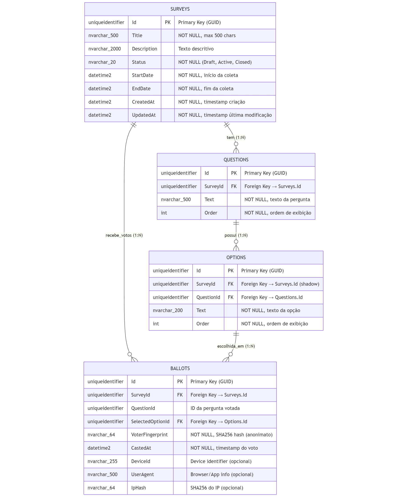
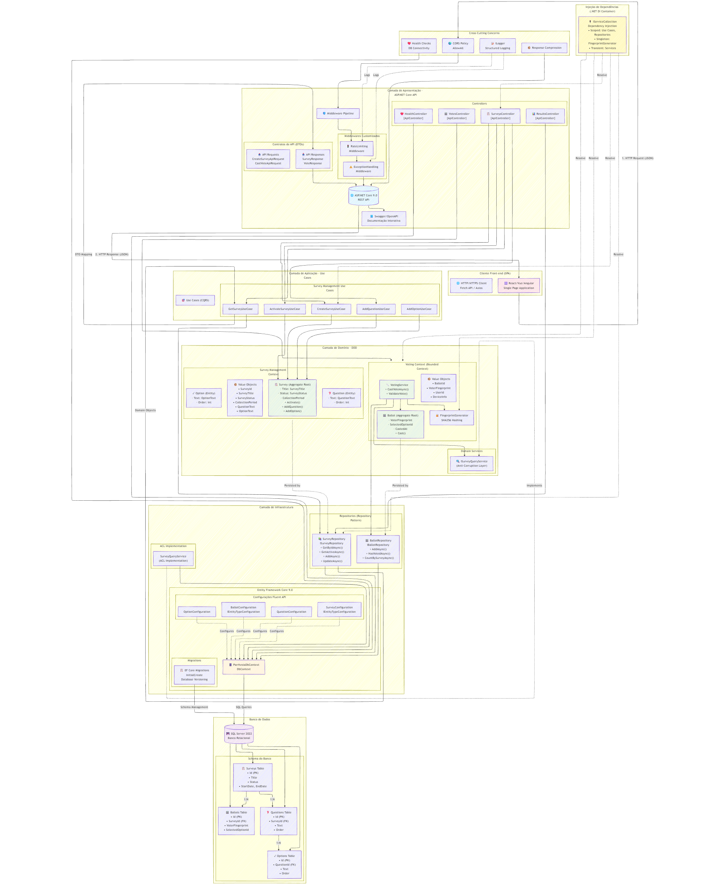
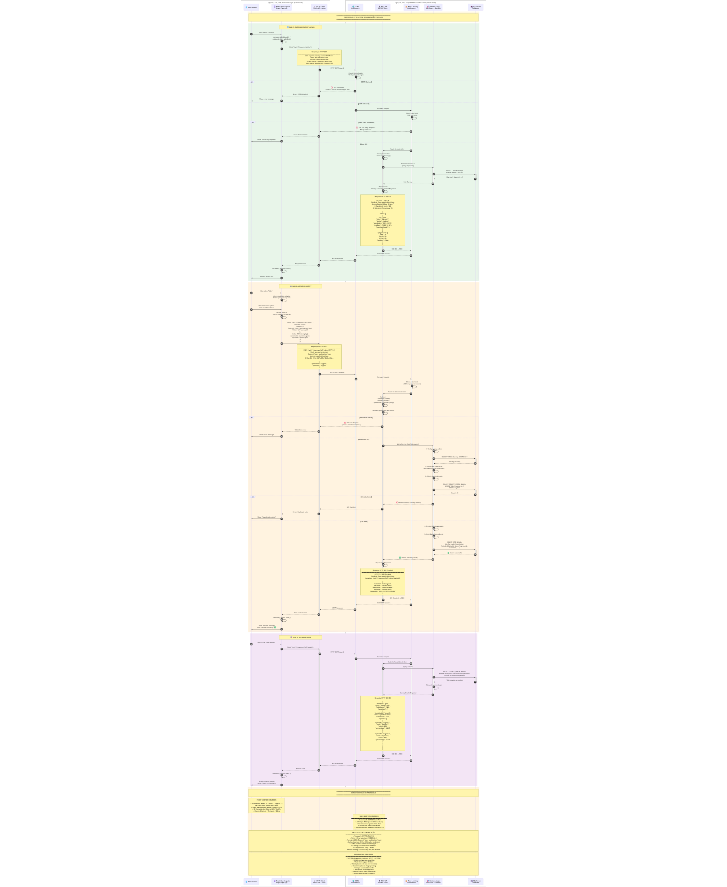

# Parrhesia - Documento de Arquitetura e Justificativas Técnicas

## 1. Visão Geral do Projeto

**Parrhesia** é uma plataforma de pesquisas e votação construída com .NET 9, aplicando princípios de Domain-Driven Design (DDD), Clean Architecture e padrões corporativos. O sistema permite a criação, gerenciamento e votação em pesquisas, garantindo integridade, segurança e escalabilidade.

---

## 2. Arquitetura e Componentes do .NET Framework

### 2.1 Escolha da Plataforma: .NET 9

**Decisão:** Utilizar .NET 9 com ASP.NET Core para construir uma API RESTful moderna e performática.

**Justificativa:**
- **.NET 9** é a versão mais recente do framework, oferecendo melhorias significativas em performance, suporte a novas funcionalidades e segurança
- **ASP.NET Core** fornece um framework robusto para construção de APIs web, com suporte nativo a middlewares, injeção de dependências e configuração flexível
- **Cross-platform:** O .NET 9 permite execução em Windows, Linux e macOS, facilitando deployment em containers Docker
- **Performance:** Otimizações no runtime e no compilador JIT garantem melhor throughput e menor latência
- **Suporte a longo prazo (LTS):** Garante atualizações de segurança e correções por período estendido

**Componentes Utilizados:**
```csharp
// Program.cs - Configuração do ASP.NET Core
var builder = WebApplication.CreateBuilder(args);
builder.Services.AddApiServices(builder.Configuration);
builder.Services.AddResponseCompression();

var app = builder.Build();
app.UseMiddleware<ExceptionHandlingMiddleware>();
app.UseMiddleware<RateLimitingMiddleware>();
app.MapControllers();
app.Run();
```

### 2.2 Entity Framework Core 9.0

**Decisão:** Utilizar Entity Framework Core como ORM para acesso a dados.

**Justificativa:**
- **Abstração do Banco de Dados:** EF Core permite trabalhar com objetos .NET ao invés de SQL direto, reduzindo complexidade
- **Migrations:** Sistema robusto para versionamento e evolução do schema do banco de dados
- **Performance:** EF Core 9.0 traz otimizações significativas em queries, tracking e compilação de expressões
- **Type Safety:** Queries são verificadas em tempo de compilação, reduzindo erros em runtime
- **Suporte a SQL Server:** Integração nativa com SQL Server, aproveitando recursos avançados do banco

**Implementação:**
```csharp
// DependencyInjection.cs
services.AddDbContext<ParrhesiaDbContext>(options =>
{
    options.UseSqlServer(connectionString);
    options.ConfigureWarnings(warnings =>
        warnings.Ignore(RelationalEventId.PendingModelChangesWarning));
});
```

**Configurações de Entidades:**
```csharp
// SurveyConfiguration.cs - Mapeamento de Value Objects e Agregados
builder.Property(s => s.Title)
    .HasConversion(
        v => v.Value,
        v => SurveyTitle.Create(v))
    .HasMaxLength(500)
    .IsRequired();

builder.OwnsOne(s => s.CollectionPeriod, cp =>
{
    cp.Property(p => p.StartDate).HasColumnName("StartDate").IsRequired();
    cp.Property(p => p.EndDate).HasColumnName("EndDate").IsRequired();
});
```

### 2.3 Dependency Injection (DI)

**Decisão:** Utilizar o container de DI nativo do ASP.NET Core para gerenciar dependências.

**Justificativa:**
- **Inversão de Controle:** Promove baixo acoplamento e facilita testes unitários
- **Lifecycle Management:** Controle de escopos (Singleton, Scoped, Transient) gerenciado automaticamente
- **Integração Nativa:** Totalmente integrado com o pipeline do ASP.NET Core
- **Testabilidade:** Facilita criação de mocks e substituição de implementações

**Implementação:**
```csharp
// ServiceCollectionExtensions.cs
services.AddScoped<ISurveyRepository, SurveyRepository>();
services.AddScoped<IBallotRepository, BallotRepository>();
services.AddScoped<IVotingService, VotingService>();
services.AddSingleton<IFingerprintGenerator>(_ => 
    new FingerprintGenerator(fingerprintSalt));

// Use Cases
services.AddScoped<IUseCase<CreateSurveyRequest, Result<CreateSurveyResponse>>, 
    CreateSurveyUseCase>();
```

### 2.4 Middleware Pipeline

**Decisão:** Implementar middlewares customizados para tratamento de exceções e rate limiting.

**Justificativa:**
- **Separação de Responsabilidades:** Cross-cutting concerns tratados em camada específica
- **Reusabilidade:** Lógica aplicada a todas as requisições sem duplicação de código
- **Ordem de Execução:** Pipeline configurável permite controle fino da ordem de processamento
- **Performance:** Processamento assíncrono e eficiente de requisições

**Implementação:**
```csharp
// ExceptionHandlingMiddleware.cs
public async Task InvokeAsync(HttpContext context)
{
    try
    {
        await _next(context);
    }
    catch (Exception ex)
    {
        await HandleExceptionAsync(context, ex);
    }
}

// RateLimitingMiddleware.cs - Proteção contra abuse
private const int MaxRequestsPerMinute = 100;
private const int VotingMaxRequestsPerMinute = 500;
```

---

## 3. Arquitetura Web com ASP.NET

### 3.1 API RESTful

**Decisão:** Construir uma API REST seguindo princípios HTTP e convenções RESTful.

**Justificativa:**
- **Padrão da Indústria:** REST é amplamente adotado e compreendido
- **Stateless:** Cada requisição contém todas as informações necessárias, facilitando escalabilidade
- **Cacheável:** Respostas podem ser cacheadas para melhor performance
- **Documentação:** Swagger/OpenAPI gera documentação interativa automaticamente

**Estrutura de Controllers:**
```csharp
[ApiController]
[Route("api/v1/surveys")]
[Produces("application/json")]
public class SurveysController : ControllerBase
{
    // GET api/v1/surveys
    [HttpGet]
    public async Task<IActionResult> GetSurveys(...)
    
    // POST api/v1/surveys
    [HttpPost]
    public async Task<IActionResult> CreateSurvey(...)
    
    // GET api/v1/surveys/{id}
    [HttpGet("{id:guid}")]
    public async Task<IActionResult> GetSurvey(Guid id, ...)
    
    // POST api/v1/surveys/{id}/activate
    [HttpPost("{id:guid}/activate")]
    public async Task<IActionResult> ActivateSurvey(Guid id, ...)
}
```

### 3.2 Documentação com Swagger

**Decisão:** Integrar Swagger/OpenAPI para documentação automática da API.

**Justificativa:**
- **Descoberta:** Desenvolvedores podem explorar endpoints interativamente
- **Contratos:** Define claramente requests, responses e schemas
- **Testabilidade:** Interface permite testar endpoints sem ferramentas externas
- **Geração de Clientes:** Documentação OpenAPI pode gerar clientes em várias linguagens

**Configuração:**
```csharp
services.AddSwaggerGen(options =>
{
    options.SwaggerDoc("v1", new OpenApiInfo
    {
        Title = "Parrhesia API",
        Version = "v1",
        Description = "Survey and voting platform API"
    });
});

app.UseSwagger();
app.UseSwaggerUI(c =>
{
    c.SwaggerEndpoint("/swagger/v1/swagger.json", "Parrhesia API v1");
    c.RoutePrefix = string.Empty;
});
```

### 3.3 Content Negotiation e Data Contracts

**Decisão:** Usar Data Transfer Objects (DTOs) com validação via Data Annotations.

**Justificativa:**
- **Separação de Concerns:** Modelos de API independentes do domínio
- **Validação Declarativa:** Atributos do .NET validam dados automaticamente
- **Versionamento:** Mudanças na API não afetam diretamente o domínio
- **Segurança:** Controle preciso sobre dados expostos

**Exemplos:**
```csharp
public record CreateSurveyApiRequest
{
    [Required]
    [StringLength(500, MinimumLength = 1)]
    public string Title { get; init; } = string.Empty;

    [StringLength(2000)]
    public string Description { get; init; } = string.Empty;

    [Required]
    public DateTime StartDate { get; init; }

    [Required]
    public DateTime EndDate { get; init; }
}

public record ApiResponse<T>
{
    public bool Success { get; init; }
    public T? Data { get; init; }
    public string? Error { get; init; }
}
```

### 3.4 Health Checks

**Decisão:** Implementar endpoints de health check para monitoramento.

**Justificativa:**
- **Observabilidade:** Kubernetes/Docker podem verificar saúde da aplicação
- **Diagnóstico:** Verifica conectividade com banco de dados e outros serviços
- **Automação:** Permite restart automático de containers com problemas

**Implementação:**
```csharp
[HttpGet("health")]
public IActionResult Get() => Ok(new 
{ 
    status = "healthy", 
    timestamp = DateTime.UtcNow 
});

[HttpGet("health/ready")]
public async Task<IActionResult> Ready()
{
    var canConnect = await _dbContext.Database.CanConnectAsync();
    return canConnect 
        ? Ok(new { status = "ready" })
        : StatusCode(503, new { status = "not_ready" });
}
```

---

## 4. Acesso a Dados com Entity Framework

### 4.1 Repository Pattern

**Decisão:** Implementar o padrão Repository para abstrair acesso a dados.

**Justificativa:**
- **Separação de Responsabilidades:** Lógica de persistência isolada do domínio
- **Testabilidade:** Facilita criação de mocks para testes unitários
- **Flexibilidade:** Permite trocar implementação de persistência sem afetar domínio
- **Agregados DDD:** Repositórios operam em agregados completos, não em entidades individuais

**Interface do Repositório:**
```csharp
public interface ISurveyRepository
{
    Task<Survey?> GetByIdAsync(SurveyId id, CancellationToken cancellationToken = default);
    Task<IReadOnlyList<Survey>> GetActiveAsync(CancellationToken cancellationToken = default);
    Task<int> CountActiveAsync(CancellationToken cancellationToken = default);
    Task AddAsync(Survey survey, CancellationToken cancellationToken = default);
    Task UpdateAsync(Survey survey, CancellationToken cancellationToken = default);
}
```

**Implementação:**
```csharp
public class SurveyRepository : ISurveyRepository
{
    private readonly ParrhesiaDbContext _context;

    public async Task<Survey?> GetByIdAsync(SurveyId id, ...)
    {
        var survey = await _context.Surveys
            .AsNoTracking()
            .FirstOrDefaultAsync(s => s.Id == id.Value, cancellationToken);
        
        // Reconstituição do agregado com entidades relacionadas
        var questions = await _context.Questions
            .Where(q => EF.Property<Guid>(q, "SurveyId") == id.Value)
            .ToListAsync(cancellationToken);
            
        return ReconstituteSurvey(survey, questions, options);
    }
}
```

### 4.2 Migrations e Schema Management

**Decisão:** Utilizar EF Core Migrations para versionamento do banco de dados.

**Justificativa:**
- **Histórico:** Cada mudança no schema é registrada e versionada
- **Automação:** Migrations podem ser aplicadas automaticamente no startup (dev) ou via CI/CD (prod)
- **Rollback:** Permite reverter mudanças em caso de problemas
- **Reprodutibilidade:** Garante que todos os ambientes tenham o mesmo schema

**Aplicação de Migrations:**
```csharp
public static async Task ApplyMigrationsAsync(this IServiceProvider services)
{
    using var scope = services.CreateScope();
    var dbContext = scope.ServiceProvider.GetRequiredService<ParrhesiaDbContext>();
    
    for (int i = 1; i <= maxRetries; i++)
    {
        try
        {
            await dbContext.Database.MigrateAsync();
            return;
        }
        catch (Exception ex)
        {
            if (i == maxRetries) throw;
            await Task.Delay(TimeSpan.FromSeconds(delaySeconds));
        }
    }
}
```

### 4.3 Configuração de Entidades (Fluent API)

**Decisão:** Usar Fluent API para configurar mapeamento objeto-relacional.

**Justificativa:**
- **Separação:** Configurações isoladas em classes específicas
- **Type Safety:** Configuração fortemente tipada, detecta erros em compile-time
- **Flexibilidade:** Permite configurações complexas não suportadas por atributos
- **Manutenibilidade:** Mudanças no mapeamento não afetam as classes de domínio

**Exemplo de Configuração:**
```csharp
public class BallotConfiguration : IEntityTypeConfiguration<Ballot>
{
    public void Configure(EntityTypeBuilder<Ballot> builder)
    {
        builder.ToTable("Ballots");
        builder.HasKey(b => b.Id);
        
        // Conversão de Value Objects
        builder.Property(b => b.VoterFingerprint)
            .HasConversion(
                v => v.Value,
                v => VoterFingerprint.Reconstitute(v))
            .HasMaxLength(64);
        
        // Índices para performance
        builder.HasIndex(b => new { b.VoterFingerprint, b.SurveyId })
            .IsUnique();
    }
}
```

### 4.4 Otimizações de Performance

**Decisão:** Implementar estratégias de otimização de queries e tracking.

**Justificativa:**
- **AsNoTracking:** Para queries read-only, elimina overhead do change tracker
- **Eager Loading:** Carrega entidades relacionadas em uma única query quando necessário
- **Índices:** Criados em colunas frequentemente consultadas
- **Projeções:** Seleciona apenas dados necessários, reduzindo transferência de dados

**Implementação:**
```csharp
// No tracking para leitura
var surveys = await _context.Surveys
    .AsNoTracking()
    .Where(s => s.Status == SurveyStatus.Active)
    .ToListAsync();

// Índices estratégicos
builder.HasIndex(b => new { b.VoterFingerprint, b.SurveyId }).IsUnique();
builder.HasIndex(b => b.CastedAt);
```

---

## 5. Integração Back-end e Front-end

### 5.1 Protocolo HTTP/HTTPS

**Decisão:** API comunica via HTTP/HTTPS usando JSON como formato de dados.

**Justificativa:**
- **Universalidade:** HTTP é suportado por todas as plataformas e linguagens
- **Simplicidade:** Verbos HTTP (GET, POST, PUT, DELETE) mapeiam naturalmente para operações CRUD
- **Segurança:** HTTPS garante criptografia end-to-end
- **Firewall-friendly:** Porta 443 raramente é bloqueada

**Configuração HTTPS:**
```csharp
app.UseHttpsRedirection(); // Redireciona HTTP para HTTPS
app.UseCors("AllowAll");   // CORS para acesso cross-origin
```

### 5.2 CORS (Cross-Origin Resource Sharing)

**Decisão:** Configurar CORS para permitir acesso de aplicações front-end em domínios diferentes.

**Justificativa:**
- **SPA (Single Page Applications):** Frontend moderno (React, Vue, Angular) geralmente roda em domínio diferente
- **Segurança Controlada:** Define quais origens podem acessar a API
- **Flexibilidade:** Permite configuração granular de headers e métodos

**Configuração:**
```csharp
services.AddCors(options =>
{
    options.AddPolicy("AllowAll", builder =>
    {
        builder.AllowAnyOrigin()
               .AllowAnyMethod()
               .AllowAnyHeader()
               .WithExposedHeaders("X-RateLimit-Limit", "X-RateLimit-Remaining");
    });
});
```

### 5.3 Contratos de API (DTOs)

**Decisão:** Definir contratos claros entre front-end e back-end usando DTOs.

**Justificativa:**
- **Estabilidade:** Mudanças no domínio não quebram contratos da API
- **Documentação:** Swagger gera documentação a partir dos DTOs
- **Versionamento:** Facilita manter múltiplas versões da API
- **Validação:** Data Annotations garantem dados válidos

**Contratos de Votação:**
```csharp
public record CastVoteApiRequest
{
    [Required]
    public Guid QuestionId { get; init; }

    [Required]
    public Guid OptionId { get; init; }
}

public record VoteResponse
{
    public Guid BallotId { get; init; }
    public Guid SurveyId { get; init; }
    public DateTime CastedAt { get; init; }
}
```

### 5.4 Rate Limiting

**Decisão:** Implementar rate limiting para proteger a API contra abuso.

**Justificativa:**
- **Proteção:** Previne ataques de negação de serviço (DoS)
- **Fair Use:** Garante recursos para todos os usuários
- **Diferenciação:** Limites diferentes para endpoints críticos (votação)

**Implementação:**
```csharp
private const int MaxRequestsPerMinute = 100;
private const int VotingMaxRequestsPerMinute = 500;

private static int DetermineRateLimit(string path)
{
    if (path.Contains("/votes") && !path.Contains("/count"))
        return VotingMaxRequestsPerMinute;
    return MaxRequestsPerMinute;
}
```

---

## 6. Testes e Qualidade

### 6.1 Estratégia de Testes

**Decisão:** Implementar testes em múltiplas camadas (unitários, integração, E2E).

**Justificativa:**
- **Confiabilidade:** Detecta bugs antes de chegarem à produção
- **Refactoring Seguro:** Permite mudanças sem medo de quebrar funcionalidades
- **Documentação Viva:** Testes servem como exemplos de uso

**Demonstração via Health Checks:**
```csharp
// Endpoint testável que verifica dependências
[HttpGet("health/detailed")]
public async Task<IActionResult> GetDetailed()
{
    var checks = new Dictionary<string, object>();
    
    try
    {
        var canConnect = await _dbContext.Database.CanConnectAsync();
        checks["database"] = new { status = canConnect ? "healthy" : "unhealthy" };
    }
    catch (Exception ex)
    {
        checks["database"] = new { status = "unhealthy", error = ex.Message };
    }
    
    return Ok(new { status = "healthy", checks });
}
```

### 6.2 Testabilidade da Arquitetura

**Decisão:** Desenhar componentes com alta testabilidade usando injeção de dependências.

**Justificativa:**
- **Mocks:** Interfaces permitem substituir implementações reais por mocks
- **Isolamento:** Cada camada pode ser testada independentemente
- **Rapidez:** Testes unitários não dependem de banco de dados ou rede

**Exemplo de Design Testável:**
```csharp
public class VotingService : IVotingService
{
    private readonly IBallotRepository _ballotRepository;
    private readonly IFingerprintGenerator _fingerprintGenerator;
    private readonly ISurveyQueryService _surveyQueryService;

    // Dependências injetadas - facilmente mockáveis
    public VotingService(
        IBallotRepository ballotRepository,
        IFingerprintGenerator fingerprintGenerator,
        ISurveyQueryService surveyQueryService)
    {
        _ballotRepository = ballotRepository;
        _fingerprintGenerator = fingerprintGenerator;
        _surveyQueryService = surveyQueryService;
    }
}
```

---

## 7. Deployment e Containerização

### 7.1 Docker

**Decisão:** Containerizar a aplicação usando Docker.

**Justificativa:**
- **Consistência:** "Funciona na minha máquina" deixa de ser problema
- **Isolamento:** Cada serviço em seu próprio container
- **Escalabilidade:** Fácil replicação horizontal
- **CI/CD:** Integração com pipelines de deployment

**Dockerfile Multi-Stage:**
```dockerfile
# Build stage
FROM mcr.microsoft.com/dotnet/sdk:9.0 AS build
WORKDIR /src
COPY . .
RUN dotnet restore
RUN dotnet publish -c Release -o /app/publish

# Runtime stage
FROM mcr.microsoft.com/dotnet/aspnet:9.0 AS runtime
WORKDIR /app
COPY --from=publish /app/publish .
EXPOSE 8080
HEALTHCHECK --interval=30s CMD curl -f http://localhost:8080/health || exit 1
ENTRYPOINT ["dotnet", "Parrhesia.Api.dll"]
```

### 7.2 Configuração Ambiental

**Decisão:** Usar arquivos `appsettings.json` e variáveis de ambiente para configuração.

**Justificativa:**
- **Segurança:** Segredos não ficam no código
- **Flexibilidade:** Mesma imagem Docker pode rodar em dev, staging e prod
- **Padrão .NET:** Usa sistema de configuração nativo do framework

**Exemplo:**
```json
{
  "ConnectionStrings": {
    "DefaultConnection": "Server=localhost;Database=Parrhesia;..."
  },
  "Security": {
    "FingerprintSalt": "CHANGE_THIS_IN_PRODUCTION"
  }
}
```


## 8 Mapas

### Diagrama de dados (Disponível em docs/DATA.[mmd,png])



### Diagrama de componentes (Disponível em docs/MAP.[mmd,png])



### Diagrama de sequência (Disponível em docs/SEQUENCE.[mmd,png])



### 9 Próximos Passos

Para evolução futura do projeto:
1. Implementar autenticação/autorização (JWT, Identity)
2. Adicionar testes automatizados (xUnit, Integration Tests)
3. Implementar caching distribuído (Redis)
4. Configurar logging estruturado (Serilog, Application Insights)
5. Deploy em ambiente cloud (Azure, AWS)
